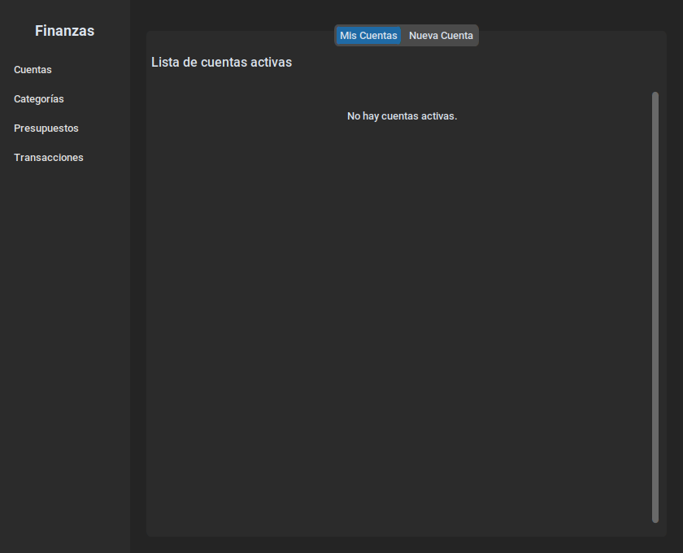
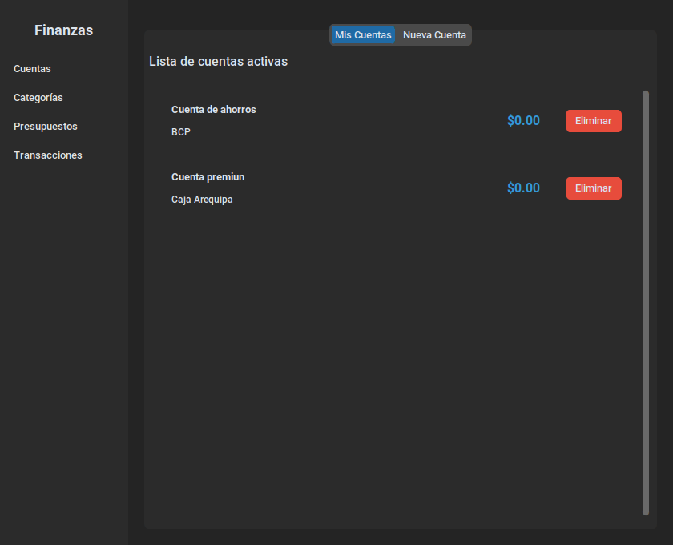
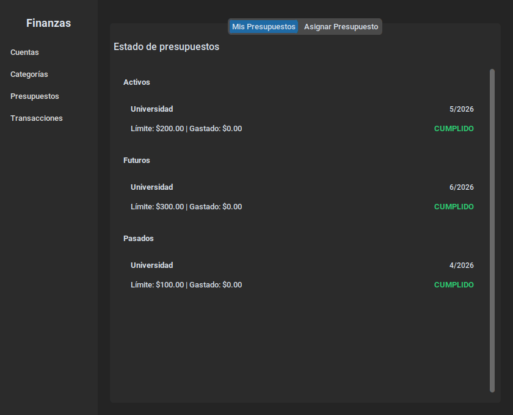
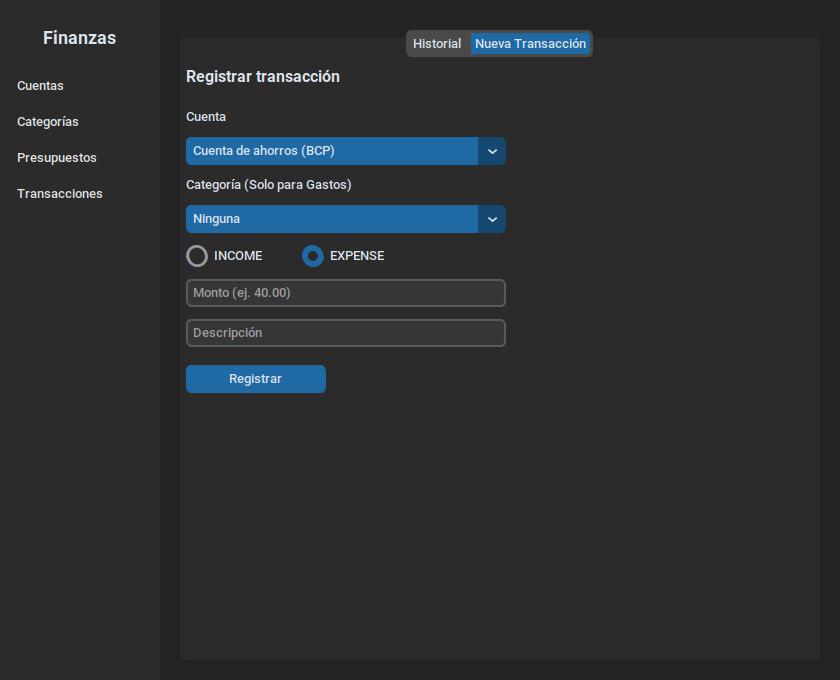
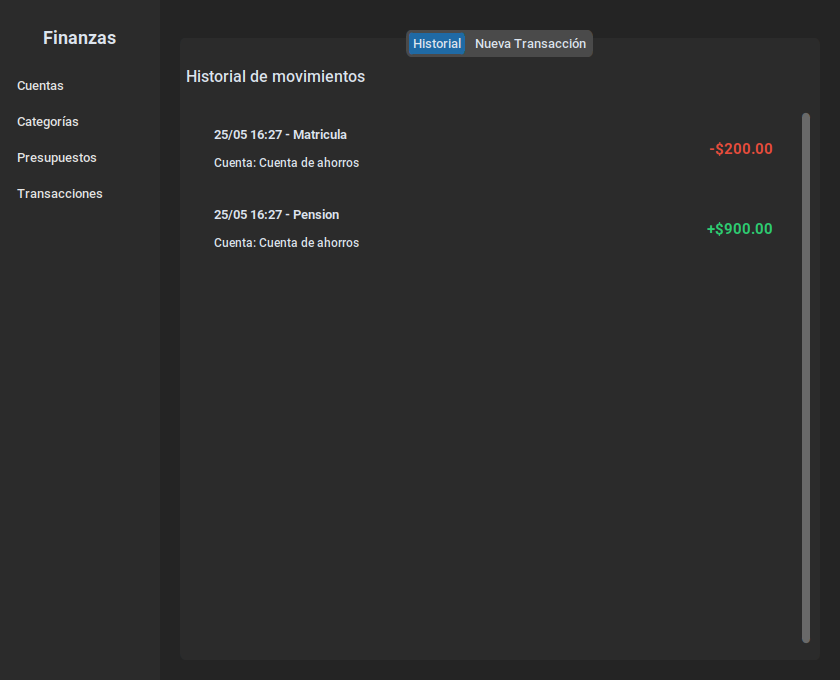

# Manual Rápido de Uso: FinanceApp

## 1. Introducción y Ejecución

**FinanceApp** es una herramienta intuitiva para el control de tus finanzas.

{width=80%}

### Cómo ejecutar

Asegúrate de estar en la raíz del proyecto y ejecuta:

```bash
uv run python -m finance
```

## 2. Gestión de Cuentas y Categorías

La aplicación organiza la gestión en pestañas. Para cada entidad puedes ver lo que tienes o crear algo nuevo.

### Cuentas

- **Pestaña "Mis Cuentas":** Lista tus bancos y saldos. Puedes eliminar (desactivar) cuentas aquí.
- **Pestaña "Nueva Cuenta":** Registra una cuenta indicando nombre y banco.

{width=80%}

### Categorías

- Funciona igual que cuentas. Úsalas para clasificar tus gastos (ej: Comida, Ropa, Servicios).

## 3. Control de Presupuestos

Planifica tus gastos por mes y categoría.

{width=80%}

- **Estados Visuales:**
  - **CUMPLIDO (Verde):** Tus gastos están dentro del límite.
  - **EXCEDIDO (Rojo):** Has gastado más de lo planeado.
- **Secciones:** Los presupuestos se agrupan automáticamente en Pasados, Activos (mes actual) y Futuros.

## 4. Registro de Movimientos

El corazón de la app es el registro de transacciones.

{width=80%}

- **Ingresos (INCOME):** Suman saldo a tu cuenta. No requieren categoría.
- **Gastos (EXPENSE):** Restan saldo. Requieren categoría obligatoria para el seguimiento del presupuesto.

### Historial de Movimientos

Visualiza tus últimos movimientos con códigos de colores:

- **Verde (+):** Dinero que entró.
- **Rojo (-):** Dinero que salió.

{width=80%}

## 5. Datos Válidos y Restricciones

- **Montos:** Siempre positivos (ej: 10.50). No uses signos, el tipo de transacción define el flujo.
- **Mes/Año:** Meses de 1 a 12. Años desde el 2000 en adelante.
- **Saldo:** La app **no te permitirá** registrar un gasto si no tienes dinero suficiente en la cuenta seleccionada.
- **Soft Delete:** Al "eliminar" algo, no desaparece de tus registros históricos, solo deja de aparecer en las opciones de selección para nuevas transacciones.
